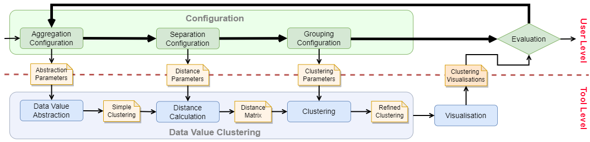
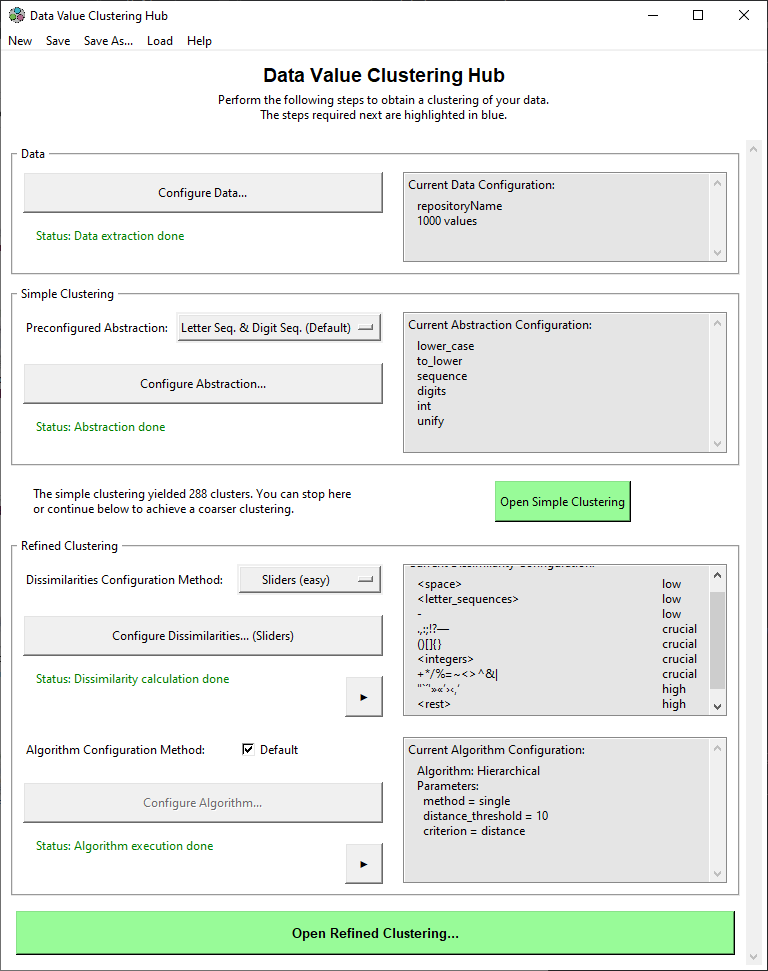
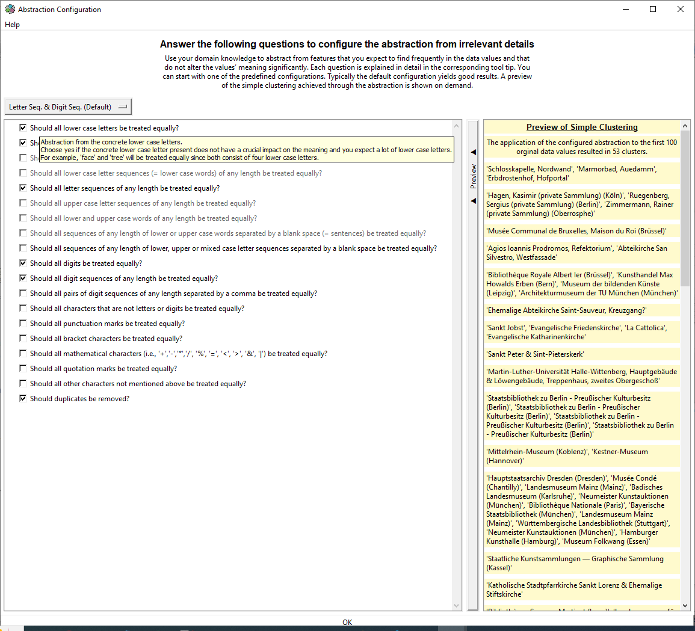
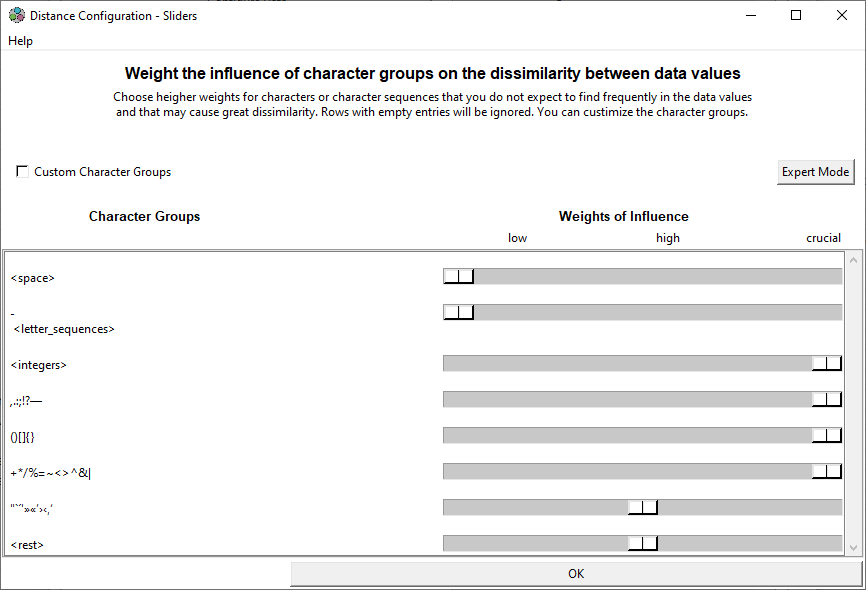
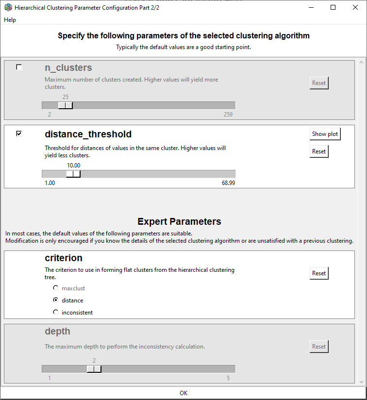
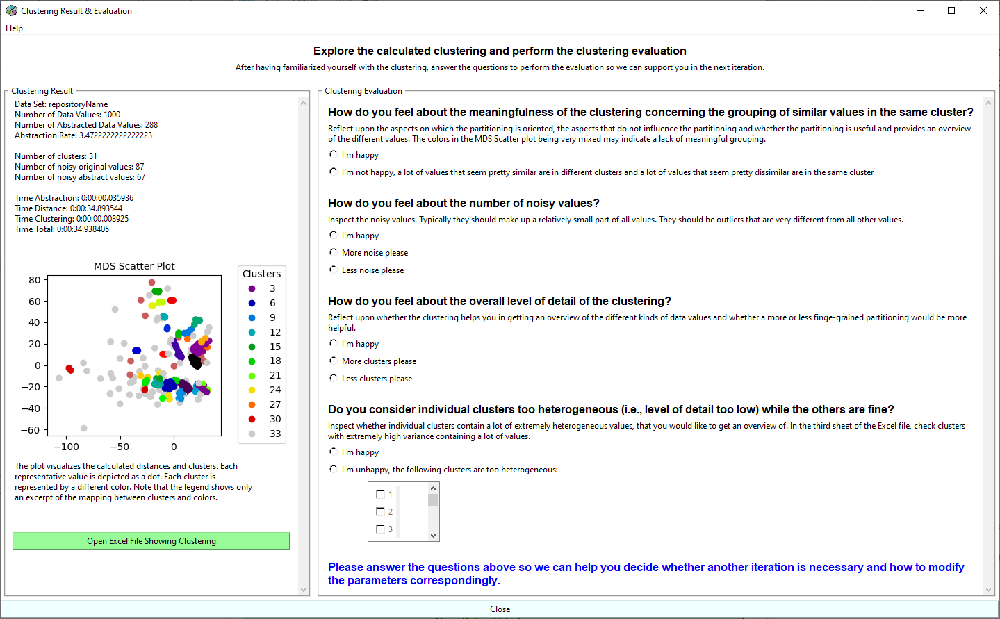

# Data Value Clustering

This tool is a proof-of-concept implementation of a bottom-up approach to analysing data quality via clusterings of heterogeneous data values.
The approach is presented in a [research paper](https://github.com/Project-KONDA/data-value-clustering/blob/master/Paper/Detecting_quality_problems_in_data_models_by_clustering_heterogeneous_data_values-extended_version.pdf).
The approach supports an explorative analysis of the existing data and can be configured by domain experts according to their domain knowledge.
All values of a selected data field are clustered by syntactic similarity.
Thereby an overview of the data values' diversity in syntax is provided.
It shall help domain experts to understand how the data model is used in practice and to get an impression of of the rules and practices of data acquisition as well as their violations.
This can be used to infer potential quality issues of the data acquisition process and system, as well as the data model and data transformations.

<!---
The approach is described in detail in the research paper "[Detecting Quality Problems in Data Models by
Clustering Heterogeneous Data Values](################)".
[//]: # (doi), published in the [proceedings](doi) of the conference "[MODELS2021](https://conf.researchr.org/home/models-2021)".
-->


This diagram gives an overview of the components and their interfaces.
The core of the tool is the Clustering-based Analyser.
It realises the workflow and controls the data flows between the other components.
It is realized via the class [```Hub```](https://github.com/Project-KONDA/data-value-clustering/blob/master/DataValueClustering/gui_center/hub.py).

The Extraction component extracts a list of data values from the database.
It currently supports BaseX XML databases.

Multiple GUI components are provided to enable the configuration of the data value clustering based on domain knowledge and to present the clustering results.

The Data Value Clustering component allows performing 3-step data value clustering via an API.
It starts with the abstraction of the original data values, which is actually a first aggregation, i.e. coarse clustering (called 'Simple Clustering'), such that values with very similar syntax are grouped in one cluster.
Next, pairwise distances (i.e. dissimilarities) between the abstracted data values are calculated based on the configuration of separating aspects.
Finally, the abstracted data values are clustered based on the grouping configuration, which results in the 'Refined Clustering'.

The Export component allows saving the parameters and the resulting clustering in a JSON file.
Further it creates a representation of the clustering as an Excel file.


## Built With

* [PyCharm 2021.1](https://www.jetbrains.com/pycharm/download/)
* [Python 3.8](https://www.python.org/downloads/release/python-380/)

<!---
This project was implemented using the PyCharm IDE. However it is possible to execute the implementation via any Python interpreter.
-->

## Installation

Required Python packages:

* [Python 3.8](https://www.python.org/downloads/release/python-380/)
* [numba](http://numba.pydata.org)
* [scipy](https://www.scipy.org)
* [scikit-learn](https://scikit-learn.org)
* [scikit-learn-extra](https://scikit-learn-extra.readthedocs.io/en/stable/install.html)
* [json](https://docs.python.org/3/library/json.html)
* [xlsxwriter](https://xlsxwriter.readthedocs.io)
* [tkinter](https://docs.python.org/3/library/tkinter.html)

<!---
## Examples

Four executable example configurations for data on cultural heritage objects, such as paintings and buildings, can be found in ```DataValueClustering\experiments\evaluation```.
They were used for the initial evaluation of the approach.
The configurations were created for the following data fields:
artist name and dating from the data model [MIDAS](https://archiv.ub.uni-heidelberg.de/artdok/3770/) as well as measurement unit and attribution qualifier from the data model [LIDO](http://www.lido-schema.org/schema/v1.0/lido-v1.0.xsd/).
The data values that the configurations are applied to can be found [here](https://github.com/Project-KONDA/data-value-clustering/tree/master/DataValueClustering/data).
The clustering results can be found [here](https://github.com/Project-KONDA/data-value-clustering/tree/master/DataValueClustering/experiments/exports/study).

<!---
These examples also were used for the evaluation of the approach in the associated research paper.
-->


## Usage

For running the GUI, [``hub.py```](https://github.com/Project-KONDA/data-value-clustering/blob/master/DataValueClustering/gui_center/hub.py) has to be executed.

## GUI

To facilitate the usage of our tool, we provide a graphical user interface.
<!---
The goal of the GUI is to provide an interface with which the numerous parameters can be configured intuitively and easily by domain experts based on their domain knowledge.
-->
Its main task is to enable the domain expert to configure the approach in such a way that all relevant domain knowledge is taken into account.
The GUI is intended to provide a user-friendly configuration that includes an understandable interface and a reduction in the large amount of parameters.
<!---
Currently, the GUI is build from multiple windows that open successively.
In the future we will reimplement the center window, to be the real center of configuration.
It shall be able to start the data value clustering process and present the results.
Further it shall provide the reentry point for new iterations.
-->



The configuration workflow supported by the GUI is visualised above.
Each configuration step results in input parameters to one of the data value clustering steps.

### Configuration Workflow



The configuration workflow is realised by a central view, called Hub View, which guides the user through the configuration steps.
In this view, the user can make basic settings and access the views for each configuration step, which are explained below.
For each step, a preview of the current configuration is displayed.
Also, in the Hub View, the user can save the configuration at any time during the configuration process.
Once the aggregation configuration is complete, the user can open an Excel file showing the Simple Clustering.
Once the entire configuration is complete, the user can access the Result View to investigate the Refined Clustering and begin the evaluation.

### Data Configuration
First, the data value set to be clustered must be selected.
Example data value sets extracted from cultural heritage databases are included in the tool.
Further data value sets can be extracted from a custom XML database via a corresponding view.
Alternatively, a data value set can be provided in form of a txt file that contains one value per line in the folder 'data'.

### Aggregation Configuration



For the aggregation configuration, we provide a few predefined settings that have proven successful in our experiments.
These can be selected from a drop-down menu in the Hub View.
Our default configuration, which has proven sufficient in most of our experiments, abstracts from the length of letter and digit strings while preserving special characters.
Therefore, values that differ only concerning the lengths of letter and digit strings are aggregated.
A more flexible configuration for experienced users is provided in the form of a questionnaire with  binary answers in the Aggregation Configuration View.
The questions aim to assess the importance of certain syntactical features by the expert.
For each question there is an explanation and examples.
The answers to this questionnaire are translated to valid combinations of abstraction rules.
As further aid, a preview of abstracted data values resulting from the application of these rules is displayed as examples and dynamically updated.


### Separation Configuration

The next step in the GUI is the configuration of separating features to determine dissimilarities between data values.
For this purpose, the weights of the weighted Levenshtein distance must be specified. 
This means that for each character occurring in the abstracted values, a numerical weight must be specified for its deletion and insertion.
In addition, for each combination of two such characters, a weight must be specified for their substitution.

#### Slider View



The tool offers an easy to use view for configuring separation, the Slider View shown above.
Here, the number of weights that need be specified and also their range are drastically limited, as explained below.
The Slider View displays a slider for each character group.
A character group is a group of characters with similar characteristics, such as all kinds of brackets.
Note that these groups can be configured.
Each slider has three values: low, high and decisive.
They are mapped to weights 1, 5 and 10.
We interpret these as the weights for inserting and deleting the mapped characters.
The remaining weights for substitutions between two characters are calculated as the maximum of both assigned weights.
As long as the user does not specify weights manually by adjusting the sliders, default weights are used, which are computed based on the number of occurrences of the respective characters in the abstracted values.
Our experiments have shown that this constrained configuration supported by the Slider View is sufficient in most cases.
In the unexpected case that a fine-grained adjustment is required, the user can switch to the Matrix View.


#### Matrix View
<!---

-->

The Matrix View is the most direct way to configure the weights as the user can enter each weight by hand.
However, the Matrix View requires the user to specify a large amount of weights, which can easily overwhelm inexperienced users.
It can be difficult to understand the specific effects of all of these weights.
It should be noted that not all combinations of weights are useful, and therefore some may result in unusable clusterings.
Therefore, we consider the Matrix View as an advanced option for experienced experts who desire more flexibility.


### Grouping Configuration

In the last step, the user configures how the data values are grouped based on the calculated distances to form the Refined Clustering.
This is done by selecting a clustering algorithm and configuring its parameters.
By default, our tool applies the hierarchical clustering algorithm with single linkage and a distance threshold of 10.
This means that clustering is performed in such a way that the distance between values of the same cluster is always below 10.
This configuration fits especially well with the options in the Slider View.
Remember that the weights 1, 5 and 10 can be selected as low, high and decisive in the Slider View.
Thus, two values that differ by a single character weighted as decisive will definitely end up in different clusters.
The same happens if the values differ by several characters and the sum of the associated weights is equal to or greater than 10.
Thus, with this default setting, the influence of the weights on the resulting clustering can be traced.

For a more flexible configuration, the user can freely choose one of the clustering algorithms (hierarchical clustering, k-medoids, DBSCAN, OPTICS, affinity propagation and spectral clustering) and configure its parameters.
Our tool provides a modularized view to configure these parameters via standard widgets.
For each parameter, the user is provided with explanations and appropriate default values, some of which are dynamically derived from the Simple Clustering and the calculated distances.



The modules also mimic the dependencies between the parameters of the clustering algorithms.
For example, in hierarchical clustering, there is an alternating dependency between ```n_clusters``` and ```distance_threshold```: 
only one of the parameters is required.
The parameter ```depth``` is enabled only if the option ```inconsistent``` is chosen for the parameter ```criterion```.


### Evaluation



When the configuration is complete, the user can finally access the Refined Clustering.
For this purpose, the Result View provides a statistical overview of the clustering and its visualisation in two-dimensional Cartesian space (cf. Sec.~\ref{par:visualisation}).
Most importantly, it allows saving and opening the clustering in an Excel file.


The Excel file contains different representations of the clustering in different sheets.
Each cluster is represented by a column.
One sheet represents the clustering of all original values.
Another sheet shows the condensed form of the clustering over original values as representatives, as shown in the screenshot.
In addition, the Excel file contains a sheet that shows the mapping between representatives and original values, i.e. the Simple Clustering.
In the second row the number of original values in each cluster is indicated.
The number of abstracted values per cluster is indicated in the third row.
Next to each representative value, the number of original values it represents is shown.

To support the evaluation of the clustering, the result view contains a questionnaire about the user's satisfaction with certain characteristics of the clustering.
Based on the answers, hints are given to whether further iteration might be appropriate.
If so, hints in the Hub View and configuration views indicate which parts of the configuration should be modified and in what way to achieve  more useful clustering.
For example, if the user wants more detailed clustering, the hints suggest, among other things, reducing the distance threshold when hierarchical clustering is used.
The questionnaire also allows the user to select individual clusters that he or she considers too heterogeneous for another iteration.


## Authors
 
* Viola Wenz - [viola.wenz@uni-marburg.de](mailto:viola.wenz@uni-marburg.de?subject=[GitHub]%20Data%20Value%20Clustering)  
* Arno Kesper - [arno.kesper@uni-marburg.de](mailto:arno.kesper@uni-marburg.de?subject=[GitHub]%20Data%20Value%20Clustering)  
* Gabriele Taentzer - [taentzer@uni-marburg.de](mailto:taentzer@uni-marburg.de?subject=[GitHub]%20Data%20Value%20Clustering)  

This work emerged from the research project "[KONDA](https://zenodo.org/communities/konda-project)". 


## License

GNU Lesser General Public License v3.0
