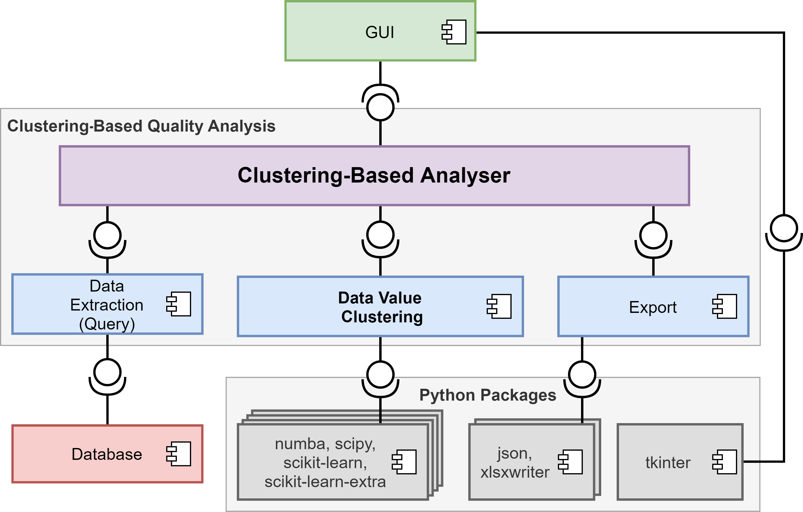
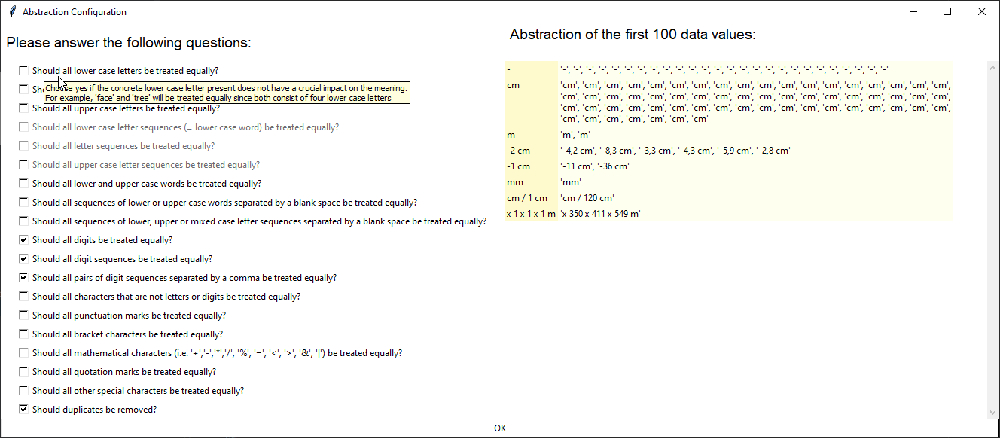
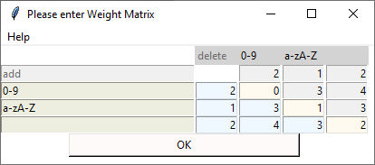
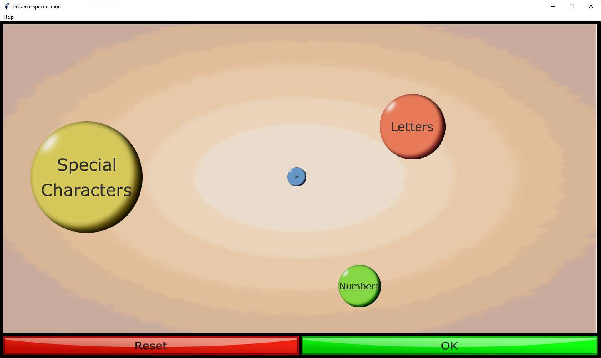
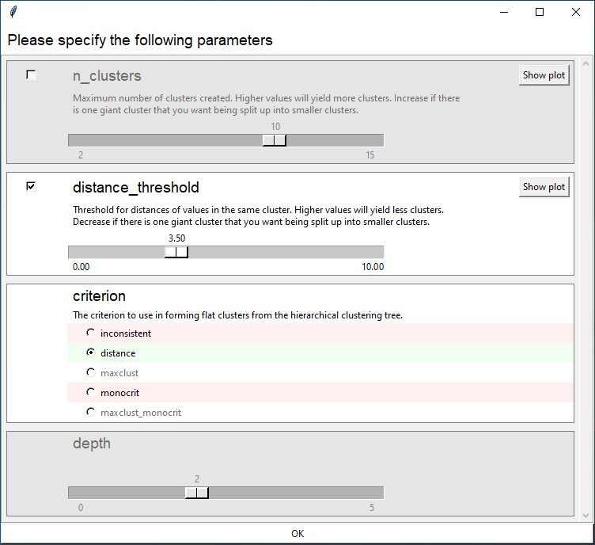
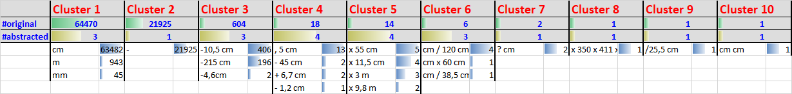

# Data Value Clustering

This tool is a proof-of-concept implementation of a bottom-up approach to detecting quality problems in data
models that manifest in heterogeneous data values.
The approach is presented in the research paper provided at ```Paper\Detecting_quality_problems_in_data_models_by_clustering_heterogeneous_data_values-extended_version.pdf```.
The approach supports an explorative analysis of the existing data and can be configured by domain experts according to their domain knowledge.
All values of a selected data field are clustered by syntactic similarity.
Thereby an overview of the data values' diversity in syntax is provided.
It shall help domain experts to understand how the data model is used in practice and to derive potential quality problems of the data model.

<!---
The approach is described in detail in the research paper "[Detecting Quality Problems in Data Models by
Clustering Heterogeneous Data Values](################)".
[//]: # (doi), published in the [proceedings](doi) of the conference "[MODELS2021](https://conf.researchr.org/home/models-2021)".
-->




This diagram gives an overview of the components and their interfaces.
The core of the tool is the Clustering-based Analyser.
It realises the workflow and controls the data flows between the other components.
It is realized via the class ```Main``` (```DataValueClustering\gui_center\main.py```).

The Extraction component is extracts a list of data values from the database.
It is not yet implemented.

Multiple GUI components are provided to enable the configuration of the data value clustering based on domain knowledge and to present the clustering results.
The GUI is still under development.

The Data Value Clustering component allows performing 3-step data value clustering via an API.
It starts with the abstraction of the original data values. Thereby irrelevant syntactical features that, according to the configuration by domain experts, are irrelevant for clustering are removed.
Next, pairwise distances (i.e. dissimilarities) between the abstracted data values are calculated based on the configuration of the distance function.
Finally, the abstracted data values are clustered via the chosen and configured clustering algorithm.

The Export component allows saving the parameters and the resulting clustering in a JSON file.
Further it creates a representation of the clustering as an Excel file.


## Built With

* [PyCharm 2021.1](https://www.jetbrains.com/pycharm/download/)
* [Python 3.8](https://www.python.org/downloads/release/python-380/)

<!---
This project was implemented using the PyCharm IDE. However it is possible to execute the implementation via any Python interpreter.
-->

## Installation

Required Python packages:

* [Python 3.8](https://www.python.org/downloads/release/python-380/)
* [numba](http://numba.pydata.org)
* [scipy](https://www.scipy.org)
* [scikit-learn](https://scikit-learn.org)
* [scikit-learn-extra](https://scikit-learn-extra.readthedocs.io/en/stable/install.html)
* [json](https://docs.python.org/3/library/json.html)
* [xlsxwriter](https://xlsxwriter.readthedocs.io)
* [tkinter](https://docs.python.org/3/library/tkinter.html)


## Examples

Four executable example configurations for data on cultural heritage objects, such as paintings and buildings, can be found in ```DataValueClustering\experiments\evaluation```.
They were used for the initial evaluation of the approach.
The configurations were created for the following data fields:
artist name and dating from the data model [MIDAS](https://archiv.ub.uni-heidelberg.de/artdok/3770/) as well as measurement unit and attribution qualifier from the data model [LIDO](http://www.lido-schema.org/schema/v1.0/lido-v1.0.xsd/).
The data values that the configurations are applied to can be found at ```DataValueClustering\data```.
The clustering results can be found in ```DataValueClustering\experiments\exports\study```.

<!---
These examples also were used for the evaluation of the approach in the associated research paper.
-->


## Usage

For running the GUI, ```main.py``` has to be executed. It can be found in ```DataValueClustering\gui_center```.


## GUI

To facilitate the usage of our tool, we provide a graphical user interface.
<!---
The goal of the GUI is to provide an interface with which the numerous parameters can be configured intuitively and easily by domain experts based on their domain knowledge.
-->
The goal is to enable domain experts to intuitively configure the numerous parameters based on their domain knowledge.
Therefore, the GUI should require as little technical understanding of the clustering process as possible.
We aim to lower the complexity by reducing the amount of parameters and determining fitting parameter values based on questionnaires adressing specific circumstances of the domain.
<!---
Currently, the GUI is build from multiple windows that open successively.
In the future we will reimplement the center window, to be the real center of configuration.
It shall be able to start the data value clustering process and present the results.
Further it shall provide the reentry point for new iterations.
-->


### Abstraction Configuration



For the configuration of the abstraction step, we provide a binary response questionnaire.
The questions aim at the expert's assessment of the importance of certain syntactical features.
Each question is accompanied by a tool tip showing additional information including an explanation and an example.
The answers are translated to valid combinations of abstraction rules. 
The result of abstracting the first 100 original values is dynamically visualized on the right-hand side.
For each abstracted value the list of all associated original values is shown.


### Distance Configuration

As a prerequisite for clustering, the similarity between the abstracted values must be measured.
For this, we support the weighted Levenshtein distance, which is an edit distance based on insertions, deletions and substitutions of characters.
The weights can be configured for each edit operation applied to each possible character.
For the configuration of the weights we offer two options explained in the following.
<!---
which is a highly configurable edit distance function for string values.
For the configuration each edit operation is assigned a weight.
As the measured distance is the accumulated sum of the weights for each performed edit operation during the transformation of one string to another.
Therefore each operation needs an associated weight, which can be dependent on the in- and outputs.
-->


#### Matrix View

A direct and flexible configuration of the distance function can be performed via the Matrix View.
Here groups of characters can be configured freely.
Every insertion, deletion and substitution of characters of these groups can be assigned a weight based on domain knowledge and personal intentions.



For this, the Matrix view offers a tabular interface.
Each cell is assigned a substitution operation between groups of characters, where the user can input a custom weight.
The table is to be read such that characters of the first column are substituted by characters of the first line.
Additions and deletions are interpreted as substitutions from or to empty strings. 
To represent this, the second column and second row is always reserved for empty strings.

The distance function needs to be symmetrical to fulfill the symmetry axiom for metrics.
Therefore, the weight matrix must be symmetrical to the diagonal.
To guarantee this, all input values are copied into the symmetrically corresponding field.


#### Blob View



As a more simple and playful approach to configuring the numerous weights of the distance function we provide the so called Blob View.
It enables the configuration of the weight matrix by moving and scaling graphical objects.

Groups of characters are represented by graphical objects, called blobs. 
They correspond to the columns and rows of the matrix.
Their distances correspond to the weights for subsitutions.
For configuring the these weights, the user can move the blobs on the 2D canvas using drag and drop.
To configure the weights for additions and deletions we use an additional blob, the small blue blob labelled with an X.
The weight for substitutions within a group is represented by the size of the corresponding blob. 
The user can modify the size using the mouse wheel while hovering over the blob.

<!---
#### Slider View (prevision)

The Slider view is the easiest way of configuring the distance function.
However it is not implemented yet.
The idea of this view is, to only configure relative importance of different groups of symbols.
For this each group will have one slider.
From the relative importances a valid weight matrix is calculated.
-->


### Clustering Algorithm Selection

We support the following clustering algorithms: hierarchical clustering, k-medoids, DBSCAN, OPTICS, affinity propagation and spectral clustering.
For the selection of a fitting algorithm, we currently provide a binary questionnaire including tool tips.
The translation into domain knowledge is subject to future work.


### Clustering Algorithm Configuration

The clustering algorithms come with many parameters.
Our tool provides a modularized view to configure these parameters via standard widgets.
<!---
It contains a checkbox, a slider or an enumeration with radio buttons, respectively.
-->
The sliders for the configuration of numerical parameters are provided with appropriate minimum and maximum values.
For enumerations, tooltips are provided for each option.



The modules also mimic the dependencies between the parameters of the clustering algorithms.
For example, in hierarchical clustering, there is an alternating dependency between ```n_clusters``` and ```distance_threshold```: 
only one of the parameters is required.
The parameter ```depth``` is enabled only if the option ```inconsistent``` is chosen for the parameter ```criterion```.


### Result



Currently, the calculated clusterings are provided via generated Excel files.
They contain two sheets showing the complete clustering of the orginal values and the clustering of the abstracted data values via original values as representatives, as shown in the screenshot.
In the second row the number of original values in each cluster is indicated.
The number of abstracted values per cluster is indicated in the third row.
Next to each representative value, the number of original values it represents is shown.
<!---
there is no real result view implemented.
Instead
-->
<!---
In the future, we plan to also present the clustering directly in the GUI.
This shall also include a questionnaire on on how satisfied the experts are with certain aspects of a produced clustering
Based on the answers, suggestions on how to modify the configuration in the next iteration will be made.
-->


## Authors
 
* Viola Wenz - [viola.wenz@uni-marburg.de](mailto:viola.wenz@uni-marburg.de?subject=[GitHub]%20Data%20Value%20Clustering)  
* Arno Kesper - [arno.kesper@uni-marburg.de](mailto:arno.kesper@uni-marburg.de?subject=[GitHub]%20Data%20Value%20Clustering)  
* Gabriele Taentzer - [taentzer@uni-marburg.de](mailto:taentzer@uni-marburg.de?subject=[GitHub]%20Data%20Value%20Clustering)  

This work emerged from the research project "[KONDA](https://zenodo.org/communities/konda-project)". 


## License

GNU Lesser General Public License v3.0
